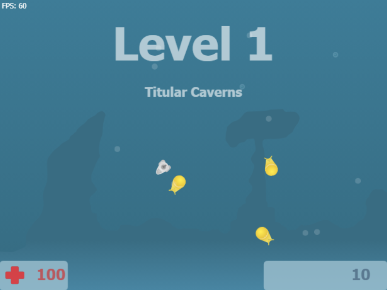

# Plonk

A TypeScript/Canvas remake of [Plonk](https://github.com/darka/plonk), originally built in Flash/ActionScript 3.

Navigate a submarine through underwater caverns, dodge enemies, and shoot your way to survival.



## Controls

- **WASD** -- Move
- **Mouse** -- Aim turret
- **Click** -- Shoot

## Running

```bash
npm install
npm run dev
```

## Testing

```bash
npm test
```

## Tech

- TypeScript, HTML5 Canvas, Vite
- 60 FPS fixed-timestep game loop
- Vitest for unit tests
- CI via GitHub Actions
